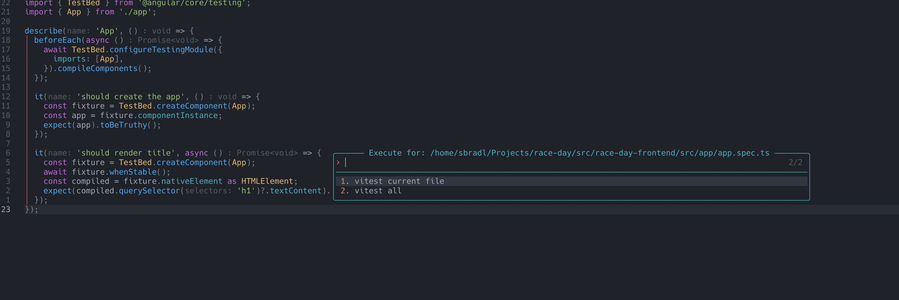

# command_runner.nvim

[](https://github.com/sbradl/command_runner.nvim/actions/workflows/ci.yml)

Configure and execute project-level and global commands.

## run_command

Based on the current file a selection of commands is displayed.


The selected command will be executed when selected.


### Rerun

After a command has been executed once, the picker offers a `Rerun: <label>`
entry at the top of the list. Rerun is a snapshot: it repeats the command
exactly as it ran before — same command line, same directory — even if the
current buffer has changed in the meantime (e.g. tests that ran in project A
are rerun in project A, even from a file in project B). The entry is offered
regardless of the current file's extension and is kept for the duration of the
Neovim session; selecting a different command replaces the snapshot.

## Requirements

- Neovim (with `vim.fs`, i.e. 0.8+). The default [autoclose](#autoclose)
  behavior additionally relies on Neovim's default `TermClose` autocmd (0.11+);
  on older versions the terminal buffer lingers after a successful command.
- [terminal.nvim](https://github.com/sbradl/terminal.nvim) — a runtime dependency, but only for commands executed in a terminal (`type = "terminal"`, the default). Commands with `type = "nvim"` do not need it.

## Installation

Using [lazy.nvim](https://github.com/folke/lazy.nvim):

```lua
{
 "sbradl/command_runner.nvim",
 dependencies = { "sbradl/terminal.nvim" },
 config = function()
  require("command_runner").setup()

  -- Bind the picker to a key of your choice.
  vim.keymap.set("n", "<leader>rc", require("command_runner").run_command, { desc = "Run command" })
 end,
}
```

## Setup

Call `require("command_runner").setup(opts)` once. Calling it again replaces the
previous configuration. `opts` is optional; with no arguments every builtin is
enabled.

```lua
require("command_runner").setup({
 -- Extra commands, keyed by file extension. Use the special key ":directory"
 -- for commands offered when the buffer has no extension.
 commands = {
  py = {
   {
    label = "run script",
    cmd = function(filename)
     return { command_line = "python " .. filename }
    end,
   },
  },
 },

 -- Builtins are opt-out: list the keys you want to disable.
 builtin = {
  disable = { "ts_playwright" },
 },

 -- Close the terminal automatically when a command exits successfully
 -- (defaults shown).
 autoclose_on_success = true,
 autoclose_delay_in_seconds = 3,
})
```

### Autoclose

With `autoclose_on_success` enabled (the default), terminal commands are sent
as `<command_line> && sleep <delay> && exit`: on success the shell exits after
`autoclose_delay_in_seconds` and Neovim deletes the terminal buffer; on failure
the shell stays open with the output. Pressing `Ctrl-C` during the delay
cancels the pending `exit` and keeps the terminal. A delay of `0` closes
immediately.

This relies on Neovim's default `TermClose` autocmd (Neovim >= 0.11) and a
shell where the `&&` chain is valid — any POSIX shell or PowerShell 7+ (where
`sleep` aliases `Start-Sleep`). Notably `cmd.exe` and Windows PowerShell 5.1
are not supported; set `autoclose_on_success = false` there.

### Builtins

Each builtin registers commands for one ecosystem and is enabled by default.
Builtins are autoloaded from [`lua/command_runner/builtin`](./lua/command_runner/builtin);
each file is named `<ext>_<name>.lua`, and its key is that filename without the
`.lua` extension (e.g. `ts_playwright`, `ex_mix`). See that directory for the
full list and the commands each one provides.

Disable specific builtins by listing their keys in `builtin.disable`:

```lua
require("command_runner").setup({
 builtin = {
  disable = { "ts_playwright", "ex_phoenix" },
 },
})
```

Or disable all of them at once with `builtin = false`:

```lua
require("command_runner").setup({ builtin = false })
```

## Project-local commands

Commands can be specified in a file called `command_runner.lua` inside a `.nvim`
directory at the project root (discovered upward from the current buffer). The
file must return a table. The keys are the extensions of the files for which
commands should be specified.

Every command needs a `label` which is displayed in the user selection.
The `cmd` is a function which returns a table with the description of the
command. The `type` determines how to execute the command. At the moment
`terminal` and `nvim` are supported. If omitted `terminal` execution will be
assumed. For `terminal` commands the `dir` specifies where the command should be
executed. Every command needs a `command_line` string for the actual command.
Optionally a `filter` function can be specified to further narrow down for which
files the command should be offered.

> A project-local file that fails to load, or that does not return a table, is
> reported via `vim.notify` at `ERROR` level and skipped — the rest of the setup
> still applies. An empty table is a valid (no-op) config.

An example for running playwright tests could look like this:

```lua
local function get_project_dir(filename)
 return vim.fs.root(filename, { "playwright.config.ts" })
end

return {
 ts = {
  {
   label = "Playwright",
   filter = function(filename)
    return get_project_dir(filename) ~= nil
   end,
   cmd = function(filename)
    local project_dir = get_project_dir(filename)

    return {
     dir = project_dir,
     command_line = "npx playwright test",
    }
   end,
  },
 },
}
```

The `filter` looks for a playwright.config.ts file above the current file's
directory. If it exists the Playwright command will be available.
